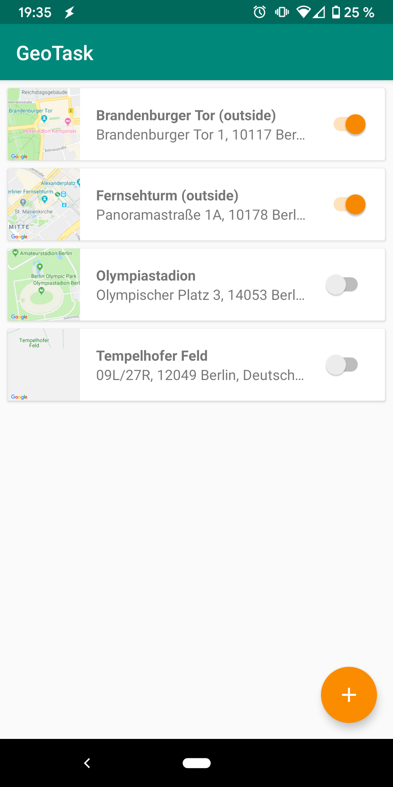
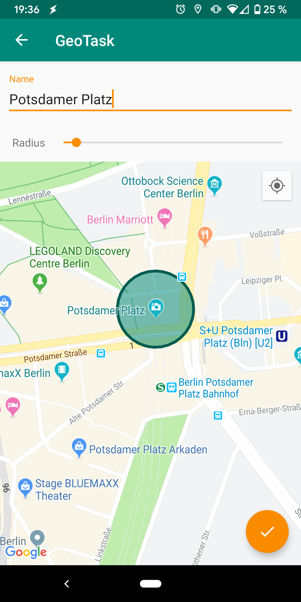
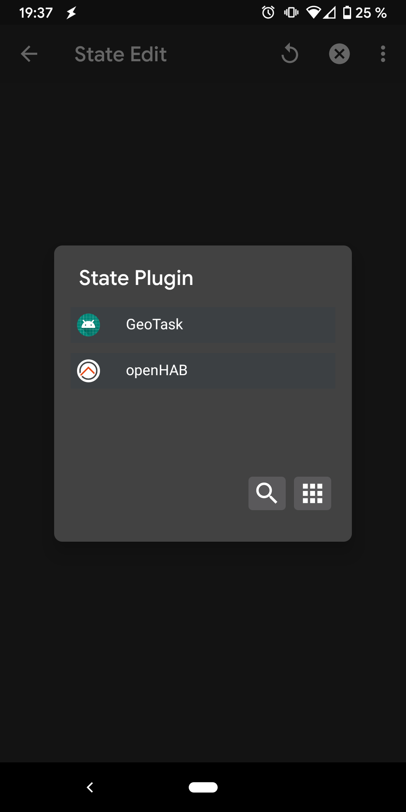
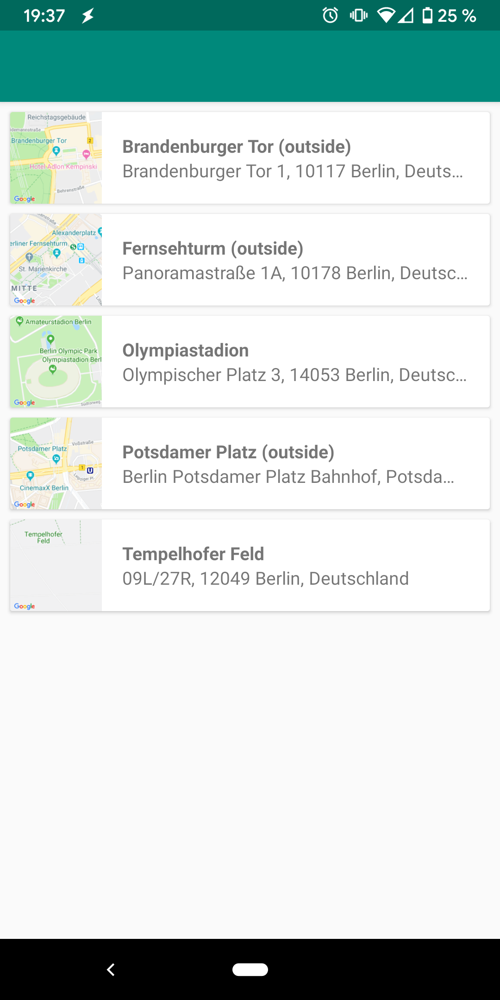
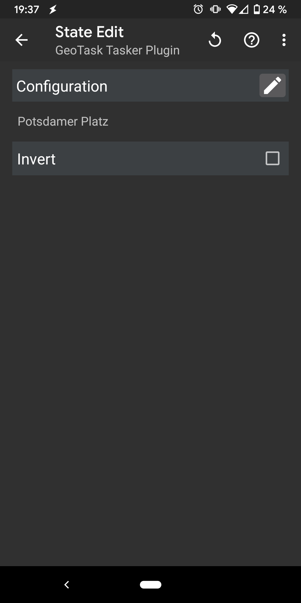

# GeoTask

Ein kleines Plugin für die bekannte Automatisierungsapp [Tasker](https://tasker.joaoapps.com/), mit dem sich Profile anhand von Geofences triggern lassen.

## Verwalten der Geofences

Aus der Detailansicht heraus kann ein bestehender Ort ausgewählt oder ein neuer Ort angelegt werden.

In der Detailansicht wird der Name, der Radius und der Ort auf der Karte ausgewählt.

   

## Einrichten eines Profils

Beim Anlegen eines State-Profils in Tasker wird GeoTask unter Plugins aufgeführt.

In der Konfigurationsansicht kann der entsprechende Ort gewählt werden.

Standardmäßig ist das Profil aktiv, wenn sich das Gerät innerhalb des Geofences befindet. Mit der Invert-Option lässt sich dieses Verhalten umkehren.

      
